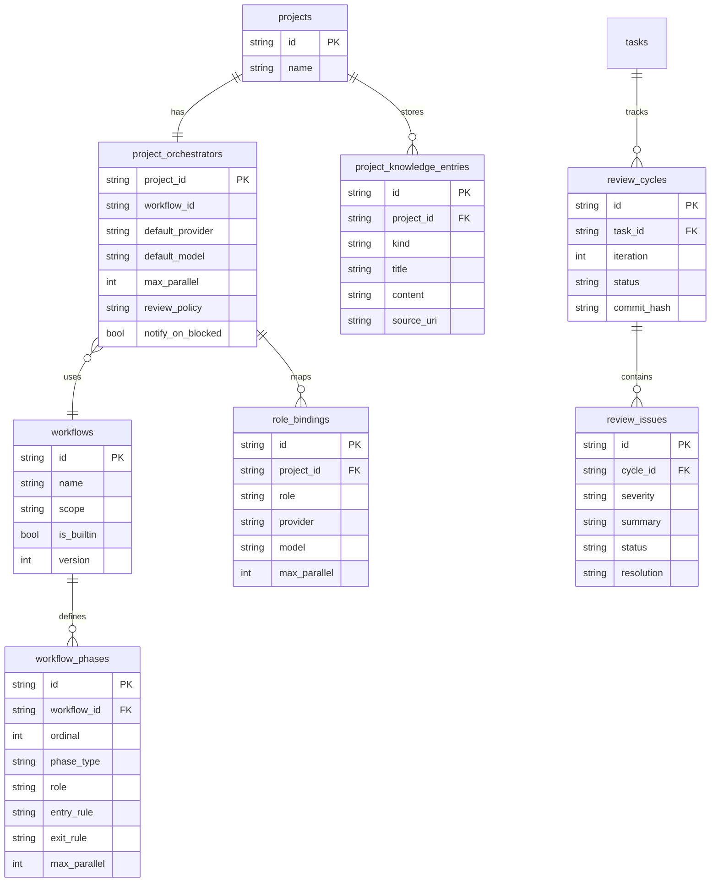

# feat: Project Orchestrator Workflow Governance

## Overview

Introduce a per-project orchestrator model where each project has its own PM configuration, workflow policy, role-to-LLM assignment, concurrency budget, review loop policy, and project-wide memory. The orchestrator remains event-driven, creates and manages tmux-backed working sessions, runs iterative code-review loops, and exposes project status via API + notifications.

This plan builds on the existing orchestrator foundation and formalizes the missing governance layer.

## Problem Statement

Current implementation provides core orchestrator chat/tool execution and basic status/reporting, but lacks:
- Per-project orchestrator config persisted with projects.
- First-class workflow/style objects (phases, role bindings, constraints).
- Scheduler constraints that enforce global + per-model + per-project parallel budgets.
- Structured project knowledge memory for design/spec context.
- Deterministic review loop state machine until issue set is empty.
- Unified push/pull status visibility surface for PM-style reporting.

Without these, users cannot encode practical workflows like:
- `scan(codebase) -> plan -> parallel implement -> mandatory review loop -> completion gate`.

## Local Research Summary

### Repo Patterns (repo-research-analyst perspective)

- Orchestrator core exists with tool loop and bounded rounds (`internal/orchestrator/orchestrator.go:18`, `internal/orchestrator/orchestrator.go:158`).
- Tool/function schema pattern already established (`internal/orchestrator/tools.go:16`, `internal/orchestrator/tools.go:133`).
- Safety rule for human takeover is already in prompt (`internal/orchestrator/prompt.go:36`).
- Event-driven trigger scaffolding already exists (`internal/orchestrator/events.go:57`).
- Current project model has only `playbook` string, no orchestrator policy object (`internal/db/models.go:17`).
- Agent registry already has `max_parallel_agents` with validation cap (`internal/registry/types.go:8`, `internal/registry/registry.go:200`).
- Session lifecycle already supports human takeover status (`internal/session/manager.go:287`, `internal/session/manager.go:298`).

### Institutional Learnings (learnings-researcher perspective)

- No `docs/solutions/` knowledge base was found in this workspace.
- Closest operational learnings are embedded in completed todos and task docs (status handling, monitor/review detection) and should be treated as baseline constraints.

### External Research Decision

Skipped for this planning step.
Reason: local repo/spec coverage is strong and this work is primarily internal architecture extension over established patterns (`SPEC.md` + implemented `TASK-15` foundation).

## SpecFlow Analysis

### Required User Flow

1. User creates project.
2. System auto-creates project orchestrator policy (default workflow + model bindings).
3. User optionally customizes workflow/style and role assignment caps.
4. User provides design/spec context.
5. Orchestrator decomposes tasks and spins up tmux work sessions.
6. Implementation enters review loop (`commit -> diff -> issues -> fix`) until pass.
7. PM reports status both on demand and via proactive notifications.

### Gaps Detected

- Missing persisted workflow entity and versioning.
- No planner/scheduler conflict resolution when requested parallelism exceeds budget.
- No canonical review-issue record model to drive loop completion criteria.
- No explicit status event feed for orchestrator-level milestones.
- No clear fallback behavior if selected model/provider unavailable.

### Added Edge Cases to Cover

- Workflow references role IDs not present in agent registry.
- Sum of planned workers exceeds global max parallel budget.
- User manually takes over a session during active orchestrator plan.
- Reviewer returns partial issues and coder produces unrelated commits.
- Notification backpressure (high-frequency status churn).

## Proposed Solution

Implement a governance layer with six pillars:

1. **Per-project orchestrator profile**
- Created at project creation.
- Stores provider/model defaults, workflow id, review policy, notification preferences, max parallel cap.

2. **Workflow/style as structured policy**
- Built-in templates: `fast`, `balanced`, `hardening`.
- User-defined workflows allowed via API/JSON (later YAML import/export).
- Workflow defines phases, role bindings, entry/exit criteria, and parallelism strategy.

3. **Constraint-aware scheduler**
- Enforce:
  - Global max concurrent sessions.
  - Per-project max concurrent sessions.
  - Per-role and per-model limits.
  - Agent registry max per agent/model.
- Scheduler returns deterministic “admit/queue/reject” decisions.

4. **Project knowledge memory**
- Persist design links, requirement summaries, architecture decisions, risks, unresolved questions.
- Orchestrator prompt pulls latest memory summary + selected workflow policy.

5. **Review loop state machine**
- Standard states: `review_pending`, `review_running`, `review_changes_requested`, `review_passed`.
- Loop continues until issue backlog is empty or explicitly waived by policy.

6. **Status visibility surface**
- Pull: report endpoints with phase, blockers, queue depth, review iteration count.
- Push: websocket/events for phase transitions, blocked states, review outcomes, completion.

## Technical Approach

### Architecture

Add a new `orchestrator governance` layer that sits between PM intent generation and tool execution:
- Prompt layer proposes actions.
- Governance layer validates actions against workflow + budgets + session safety rules.
- Executor performs approved actions through existing REST tools.

### Data Model Changes (ERD)

### API Additions

- `POST /api/projects` auto-creates orchestrator profile with defaults.
- `GET /api/projects/{id}/orchestrator`
- `PATCH /api/projects/{id}/orchestrator`
- `GET /api/workflows`
- `POST /api/workflows`
- `PUT /api/workflows/{id}`
- `DELETE /api/workflows/{id}` (non-builtin only)
- `GET /api/projects/{id}/knowledge`
- `POST /api/projects/{id}/knowledge`
- `GET /api/tasks/{id}/review-cycles`
- `GET /api/orchestrator/report?project_id=...` extend payload with workflow/queue/review loop details.

### Session Orchestration Model

Each working agent remains a tmux session (keep current architecture):
- Creation through orchestrator tools (`internal/orchestrator/tools.go`) and session lifecycle manager.
- Human intervention remains first-class through takeover lock (`internal/session/manager.go:287`).

### Notification Strategy

- Extend orchestrator websocket stream with status milestone events.
- Add lightweight event topic schema:
  - `project_phase_changed`
  - `project_blocked`
  - `review_iteration_completed`
  - `review_loop_passed`

## Implementation Phases

### Phase 1: Data & Config Foundation

Deliverables:
- New DB tables for orchestrator profile, workflows, phases, role bindings, knowledge, review cycles/issues.
- Migration + repos + tests.
- Default built-in workflows seeded at startup.

Primary files:
- `internal/db/migrations.go`
- `internal/db/models.go`
- `internal/db/*_repo.go`
- `configs/workflows/*.yaml` (if file-seeded)

Success criteria:
- Project creation guarantees exactly one orchestrator profile.
- Built-in workflows present and immutable.

Estimated effort: L

### Phase 2: Workflow Governance + Scheduler

Deliverables:
- Workflow validator.
- Constraint-aware scheduler and queue policy.
- Role-to-model binding resolution.

Primary files:
- `internal/orchestrator/workflow.go`
- `internal/orchestrator/scheduler.go`
- `internal/orchestrator/prompt.go` (inject workflow summary)
- `internal/registry/*` (read-only integration)

Success criteria:
- Planning run never schedules beyond budgets.
- Clear rejection reason returned on policy violation.

Estimated effort: L

### Phase 3: Knowledge & PM Planning Context

Deliverables:
- Knowledge CRUD endpoints and persistence.
- Prompt context assembly from design/spec memory.
- Prompt token budgeting + summarization policy for large context.

Primary files:
- `internal/api/knowledge.go`
- `internal/orchestrator/prompt.go`
- `internal/orchestrator/history_summarizer.go` (new)

Success criteria:
- Orchestrator responses reference project context accurately.
- Context build remains bounded and deterministic.

Estimated effort: M

### Phase 4: Review Loop State Machine

Deliverables:
- Review cycle + issue models.
- Diff/commit linking and iterative loop transitions.
- Exit condition enforcement (no unresolved issues).

Primary files:
- `internal/orchestrator/review_loop.go`
- `internal/automation/coordinator.go` (integration)
- `internal/api/reviews.go`

Success criteria:
- Task cannot transition to done while review issues remain open.
- Review iteration count visible in reports.

Estimated effort: L

### Phase 5: Status & Notification UX Contract

Deliverables:
- Enhanced report payload.
- Push notification events on websocket.
- PM chat status query shortcuts.

Primary files:
- `internal/api/orchestrator.go`
- `internal/hub/protocol.go`
- `internal/hub/hub.go`
- `docs/TASK-17-pm-chat-ui.md` alignment updates

Success criteria:
- User can request project status at any time and receive phase/blocker/review loop state.
- Frontend can subscribe to milestone events without polling.

Estimated effort: M

## Alternative Approaches Considered

1. **Prompt-only workflow style (no structured workflow entity)**
- Rejected: hard to validate, impossible to enforce budgets reliably.

2. **Global orchestrator config only**
- Rejected: contradicts requirement for project-specific PM behavior.

3. **Non-tmux worker abstraction**
- Rejected for now: loses direct human intervention workflow and current operational simplicity.

## Acceptance Criteria

### Functional Requirements

- [ ] Creating a project creates a default orchestrator profile automatically.
- [ ] Users can assign workflow/style and role->model bindings per project.
- [ ] Scheduler enforces configured parallel limits and agent caps.
- [ ] Orchestrator can use persisted project design knowledge in planning.
- [ ] Workers are tmux-backed sessions and support manual takeover safely.
- [ ] Review loop persists commit/diff/issues and only exits when no unresolved issues remain.
- [ ] PM status is available via API and push notifications.

### Non-Functional Requirements

- [ ] Scheduling decisions are deterministic and explainable.
- [ ] No command is sent to `human_takeover` sessions.
- [ ] Context assembly is token-bounded and resilient for large projects.

### Quality Gates

- [ ] Unit tests for workflow validator, scheduler, and review loop transitions.
- [ ] Integration tests for project-create default profile and report payload.
- [ ] WebSocket protocol tests for new PM status events.

## Success Metrics

- 90%+ orchestrator runs produce valid plans without budget violations.
- Zero incidents of commands sent to human takeover sessions.
- Median time to “first actionable task set” under 15s for medium projects.
- Review loop closure rate (no open issues at done) >= 95%.

## Dependencies & Prerequisites

- Existing orchestrator base completed (`internal/orchestrator/*`, `internal/api/orchestrator.go`).
- Session lifecycle and human takeover enforcement (`internal/session/manager.go:287`).
- Agent registry max parallel signal (`internal/registry/types.go:8`).
- Playbook system roadmap (`docs/TASK-18-playbook-system.md`).

## Risk Analysis & Mitigation

- **Risk:** Over-constrained scheduling causes queue starvation.
  - Mitigation: add queue diagnostics and fallback suggestions in report.
- **Risk:** Review loop churn with repetitive low-value issues.
  - Mitigation: deduplicate issue fingerprints and severity thresholds.
- **Risk:** Knowledge context blows token budget.
  - Mitigation: rolling summarization + source ranking.
- **Risk:** Workflow sprawl and unmaintainable user-defined configs.
  - Mitigation: schema validation + lint endpoint + immutable built-ins.

## Resource Requirements

- Backend engineer(s) familiar with current API/db/orchestrator internals.
- Frontend consumer updates for new status event types.
- Test coverage work across api/orchestrator/hub/session packages.

## Documentation Plan

- Add `docs/TASK-19-orchestrator-governance.md` (implementation task spec).
- Add workflow schema docs (`docs/workflow-schema.md`).
- Add PM operations runbook (`docs/orchestrator-operations.md`).

## AI-Era Implementation Guidance

- Preserve human-auditable planner output: scheduler decision logs and reasons.
- Keep model/provider interchangeable per role via explicit bindings.
- Treat PM prompts as policy consumers; policy itself must be machine-validated data.

## References & Research

### Internal References

- Orchestrator loop and limits: `internal/orchestrator/orchestrator.go:18`, `internal/orchestrator/orchestrator.go:158`
- Tool definitions: `internal/orchestrator/tools.go:161`
- Prompt safety rule: `internal/orchestrator/prompt.go:36`
- Event triggers: `internal/orchestrator/events.go:57`
- Project model currently only has playbook string: `internal/db/models.go:17`
- Existing schema baseline: `internal/db/migrations.go:21`
- Project creation API: `internal/api/projects.go:30`
- Human takeover semantics: `internal/session/manager.go:287`, `internal/session/manager.go:298`
- Session monitor review/idle markers: `internal/session/monitor.go:136`, `internal/session/monitor.go:184`
- Agent parallel limit field and validation: `internal/registry/types.go:8`, `internal/registry/registry.go:200`
- Current orchestrator/report routes: `internal/api/router.go:108`

### Spec References

- Playbook structure and phase role mapping: `SPEC.md:164`
- Orchestrator toolset expectations: `SPEC.md:205`
- Event-driven orchestrator mode: `SPEC.md:245`
- Human takeover rule: `SPEC.md:269`
- Worktree session role model (coder/reviewer/coord): `SPEC.md:281`
- API and websocket contracts: `SPEC.md:560`, `SPEC.md:604`

### Related Work

- Existing orchestrator implementation task: `docs/TASK-15-orchestrator.md`
- Upcoming playbook task: `docs/TASK-18-playbook-system.md`
- PM chat UI dependency: `docs/TASK-17-pm-chat-ui.md`
